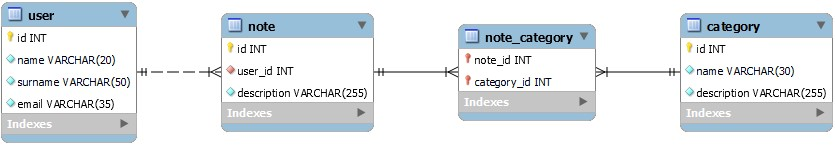

<h1 align="center">Prueba técnica backend</h1>
<h2 align="center">Desarrollar una API utilizando el framework
Symfony</h2>

## Tabla de contenidos 📝
- <a href="#objetivo">Objetivo</a>
- <a href="#diagrama-er">Diagrama Entidad Relación</a>
- <a href="#tecnologías-utilizadas">Stack - Tecnologías utilizadas</a>
- <a href="#licencia">Licencia</a>

## Objetivo
El objetivo de esta prueba técnica, es desarrollar una API utilizando el framework
Symfony que permita realizar operaciones CRUD en formato REST para las
entidades Usuario, Nota y Categoría.

## Diagrama ER


## Tecnologías utilizadas
[](https://skillicons.dev)

## Endpoints
A continuación se detallan los endpoints que han sido desarrollados en esta API para poder ser atacados desde un front. Desde Postman puedes verificar que funcionan correctamente.

<details>
<summary>Usuarios</summary>

- Endpoints referentes a la **tabla de usuarios**

    - **/users** : Recupera todos los usuarios - **GET**

            http://127.0.0.1:8000/users

    - **/user/{id}** : Recupera el usuario con el id que le pases - **GET**

            http://127.0.0.1:8000/user/3

    - **/new-user** : Crea un usuario nuevo - **POST**

            http://127.0.0.1:8000/new-user

        body:
        ``` js
            {
                "name" : "Pepe",
                "surname" : "Oltra Sanchis",
                "email" : "pepe@gmail.com"
            }
        ```

    - **/user/{id}** : Modifica el usuario con el id que le pases - **PUT**

            http://127.0.0.1:8000/user/3

        body:
        ``` js
            {
                "name" : "Pepe",
                "surname" : "Oltra Sanchis",
                "email" : "pepe@gmail.com"
            }
        ```

    - **/user/{id}** : Elimina el usuario con el id que le pases - **DELETE**

            http://127.0.0.1:8000/user/3
        
</details>
<details>
<summary>Notas</summary>

- Endpoints referentes a la **tabla de notas**

    - **/notes** : Recupera todas las notas - **GET**

            http://127.0.0.1:8000/notes

    - **/note/{id}** : Recupera la nota con el id que le pases - **GET**

            http://127.0.0.1:8000/note/3

    - **/new-note** : Crea una nota nueva - **POST**

            http://127.0.0.1:8000/new-note

        body:
        ``` js
            {
                "description":"Diseña la vista Home",
                "user": 2,
                "categories": [1,3]
            }
        ```

    - **/note/{id}** : Modifica la nota con el id que le pases - **PUT**

            http://127.0.0.1:8000/note/3
        
        body:
        ``` js
            {
                "description" : "Diseña la vista Login",
                "user" : 3
            }
        ```

    - **/user/{id}** : Elimina la nota con el id que le pases - **DELETE**

            http://127.0.0.1:8000/user/3
        
</details>
<details>
<summary>Categorías</summary>

- Endpoints referentes a la **tabla de categorías**

    - **/categories** : Recupera todas las categorías - **GET**

            http://127.0.0.1:8000/categories

    - **/category/{id}** : Recupera la categoría con el id que le pases - **GET**

            http://127.0.0.1:8000/category/3

    - **/new-category** : Crea una categoría nueva - **POST**

            http://127.0.0.1:8000/new-category

        body:
        ``` js
            {
                "name" : "Contabilidad",
                "description" : "Engloba todas las notas relacionadas con la contabilidad"
            }
        ```

    - **/category/{id}** : Modifica la categoría con el id que le pases - **PUT**

            http://127.0.0.1:8000/category/3
        
        body:
        ``` js
            {
                "name" : "Nuevo nombre",
                "description" : "Nueva descripción"
            }
        ```

    - **/category/{id}** : Elimina la categoría con el id que le pases - **DELETE**

            http://127.0.0.1:8000/category/3
        
</details>

## Licencia
Este proyecto se ha realizado bajo la **licencia MIT**.